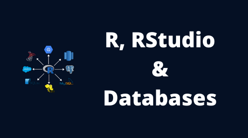

### What would you like to learn today?

::: {layout-ncol=4 .cards-4}

<a href="r-programming/" style="display: block; color: black; text-decoration: none;">  <i class="bi bi-code"></i>   R Programming   &nbsp;</a>

<a href="data-wrangling/" style="display: block; color: black; text-decoration: none;">  <i class="bi bi-tools"></i>   Data Wrangling   &nbsp;</a>

<a href="data-visualization/" style="display: block; color: black; text-decoration: none;">  <i class="bi bi-bar-chart"></i>   Data Visualization   &nbsp;</a>

<a href="posts/command-line-basics-for-r-users/" style="display: block; color: black; text-decoration: none;">  <i class="bi bi-terminal"></i>   Command Line   &nbsp;</a>

<a href="posts/working-with-databases-using-r/" style="display: block; color: black; text-decoration: none;">  <i class="bi bi-database"></i>   Databases   &nbsp;</a>

<a href="posts/regular-expression-in-r/" style="display: block; color: black; text-decoration: none;">  <i class="bi bi-percent"></i>   Regular Expressions   &nbsp;</a>

<a href="posts/handling-date-and-time-in-r/" style="display: block; color: black; text-decoration: none;">  <i class="bi bi-clock"></i>   Date &amp; Time   &nbsp;</a>

<a href="r-packages/" style="display: block; color: black; text-decoration: none;">  <i class="bi bi-gift"></i>   R Packages   &nbsp;</a>

<a href="posts/web-scraping/" style="display: block; color: black; text-decoration: none;">  <i class="bi bi-globe"></i>   Web Scraping   &nbsp;</a>

<a href="posts/customer-segmentation-using-rfm-analysis/" style="display: block; color: black; text-decoration: none;">  <i class="bi bi-people"></i>   Customer Segmentation   &nbsp;</a>

<a href="posts/market-basket-analysis-in-r/" style="display: block; color: black; text-decoration: none;">  <i class="bi bi-basket"></i>   Association Rule Mining   &nbsp;</a>

:::

### More Resources

::: {layout-ncol=3 .cards-3}

<a href="https://www.youtube.com/user/rsquaredin/videos" target="_blank" style="display: block; color: black; text-decoration: none;">
<i class="bi bi-camera-video" style="font-size: 2.5rem;"></i>

<h3>Videos</h3>

160+ Videos

</a>

<a href="https://ebooks.rsquaredacademy.com" target="_blank" style="display: block; color: black; text-decoration: none;">
<i class="bi bi-book" style="font-size: 2.5rem;"></i>

<h3>eBooks</h3>

6+ ebooks

</a>

<a href="https://pkgs.rsquaredacademy.com" target="_blank" style="display: block; color: black; text-decoration: none;">
<i class="bi bi-code" style="font-size: 2.5rem;"></i>

<h3>R Packages</h3>

10 Open Source Libraries

</a>

:::

### Trending Courses

::: {layout-ncol=4 .cards-4}

<a href="https://rsquared-academy.thinkific.com/courses/working-with-databases-using-r" target="_blank" style="text-decoration: none;">
Query, Visualize &amp; Model Data from Databases
</a>
 

<a href="https://rsquared-academy.thinkific.com/" target="_blank">By Rsquared Academy</a>

<a href="https://rsquared-academy.thinkific.com/courses/customer-segmentation-using-rfm-analysis" target="_blank" style="text-decoration: none;">
Customer Segmentation using RFM Analysis in R
</a>
 

<a href="https://rsquared-academy.thinkific.com/" target="_blank">By Rsquared Academy</a>

<a href="https://rsquared-academy.thinkific.com/courses/command-line-basics-for-r-users" target="_blank" style="text-decoration: none;">
Beginners Guide to the Command Line
</a>
 

<a href="https://rsquared-academy.thinkific.com/" target="_blank">By Rsquared Academy</a>

<a href="https://rsquared-academy.thinkific.com/courses/handling-date-and-time-in-R" target="_blank" style="text-decoration: none;">
Practical Introduction to Handling Date &amp; Time in R
</a>
 

<a href="https://rsquared-academy.thinkific.com/" target="_blank">By Rsquared Academy</a>

:::

### Popular Articles

::: {#latest}
:::
